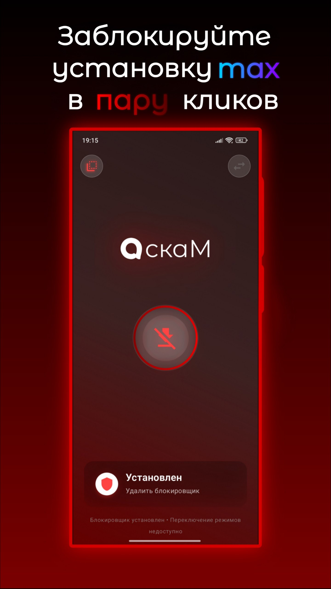

# скаМ — Сломайте Макс

 
 
 

  

  
  
   
  
  

Предотвратите открытие приложения **MAX**, или полностью заблокируйте его установку.  
Работает **без root**, в двух режимах: *активная блокировка* и *блокировка установки*.

---

## 📑 Оглавление
- [Установка](#-установка)
- [Режимы работы](#-режимы-работы)
  - [1. Активная блокировка](#1-активная-блокировка)
  - [2. Блокировка установки](#2-блокировка-установки)
- [Маскировка](#-маскировка)
- [Требования](#-требования)
- [Известные особенности](#-известные-особенности)
- [Дисклеймер](#-дисклеймер)

---

## 📥 Установка
1. Скачайте [последний релиз](https://github.com/scaik/scam-max-disabler/releases/latest)
2. Установите APK
3. Выберите режим блокировки

---

## ⚙️ Режимы работы

### 1. Активная блокировка
- Делает вид, что **MAX падает** при запуске, хотя на самом деле он не удалён.
- Переустановка MAX не помогает — он продолжает казаться «нерабочим».
- Не требует root и удаления приложений.
- Требует работающую **службу специальных возможностей**.

**Как включить:**
1. Дайте разрешения (спец. возможности, показ поверх окон, отключение оптимизации батареи, автозапуск).
2. Нажмите «ВКЛЮЧИТЬ» на главном экране.
3. Запустите MAX и убедитесь, что он «сломался».

После перезагрузки служба автоматически запуститься (если разрешения выданы).
Для стабильности держите приложение в фоне или перезагрузите устройство.

---

### 2. Блокировка установки
- Полностью предотвращает установку MAX.  
- Работает за счёт установки «пустого» APK с тем же идентификатором.  
- При активации удаляет уже установленный MAX.  
- После включения MAX нельзя установить или обновить стандартными способами.  

**Как включить:**
1. Включите режим «Блокировка установки».  
2. Если MAX уже был установлен — он будет удалён.  
3. Попробуйте установить MAX снова → установка будет невозможна.  

---

## 🕵️ Маскировка
Меняйте название и иконку приложения (например, под «Калькулятор»),  
чтобы скрыть его от посторонних 👻.  

---

## 📱 Требования
- Android **8.0+**  
- Для активной блокировки: разрешения «спец. возможности» и «показывать поверх других окон».  
- Для блокировки установки: согласие на установку/удаление APK.  

---

## ⚠️ Известные особенности
- На агрессивных прошивках (MIUI / EMUI / ColorOS / Vivo и др.) фоновая работа может прерываться.  
  👉 Следуйте рекомендациям по разрешениям для максимальной стабильности.  
- В режиме блокировки установки невозможно обновить или использовать настоящий MAX без отключения скаМ.  

---

## 📝 Дисклеймер

Автор не имеет намерений выступать против приложения MAX и не призывает к нарушению правил эксплуатации устройств или сервисов.  

Приложение предоставляется **исключительно в ознакомительных и образовательных целях** «как есть», **без каких-либо гарантий**.  
Ответственность за использование программного обеспечения, а также за соблюдение применимых законов и правил полностью возлагается на пользователя.  

Функционал приложения позволяет добровольно блокировать установку и работу любых приложений по аналогичному принципу.  
Упоминание MAX используется **только в качестве примера** и не подразумевает выделение или преднамеренное ограничение данного продукта.  
