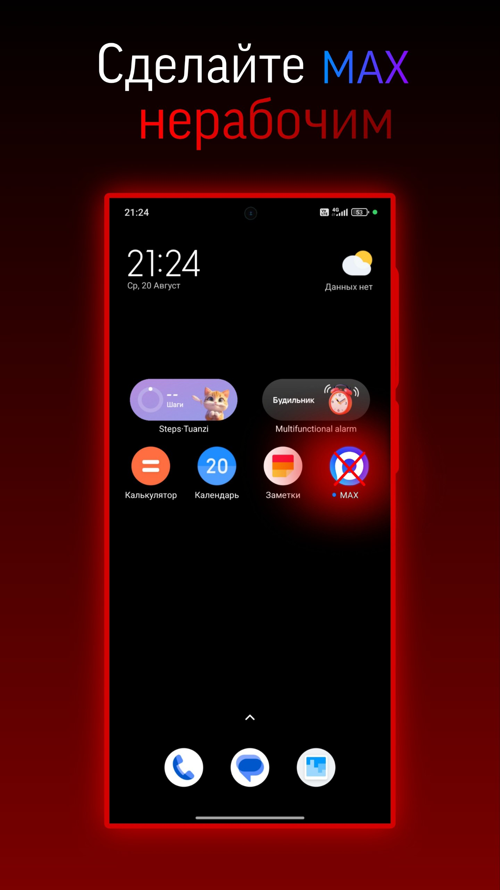
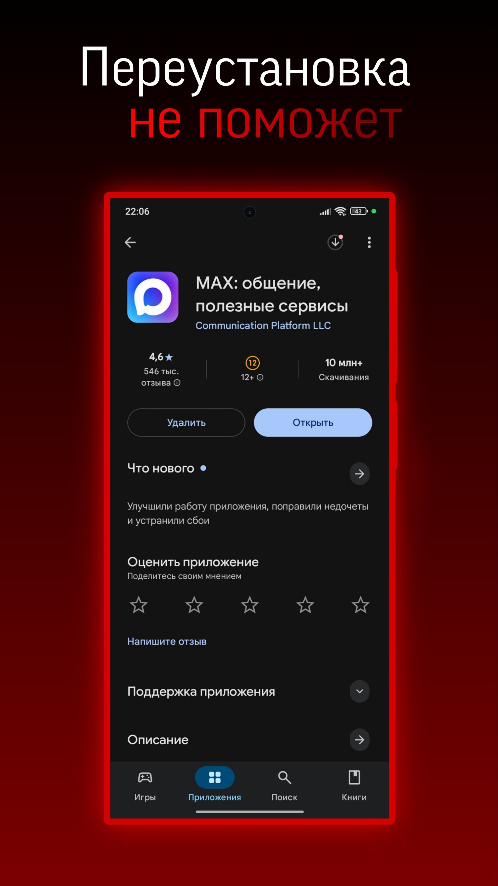
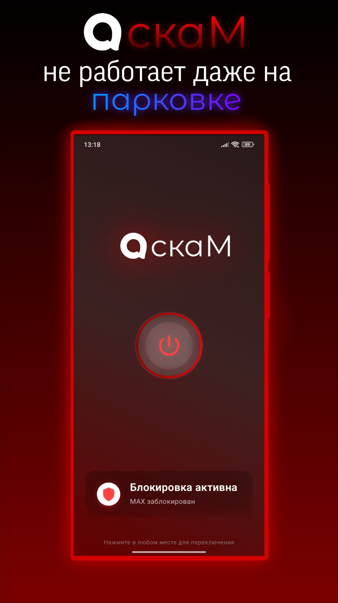

# скаМ — Сломайте Макс

  
  
  

Победите требование «установить Max», убедительно показывая, что он «не работает» на вашем устройстве.

### [СКАЧАТЬ (Последний релиз)](https://github.com/scaik/scam-max-disabler/releases/latest)

## Что вы получите
- Сделаете вид, что Max не запускается/падает — не работает на вашем устройстве.
- Без рута, без удаления приложений, без сложной настройки.

## Быстрый старт
1) Установите APK.
2) Откройте скаМ.
3) Нажмите «Открыть настройки» и включите службу спец. возможностей для приложения.
4) Нажмите «ВКЛЮЧИТЬ» в главном экране.
5) Откройте Max — получите нужный результат.

Важно: для стабильной работы держите приложение запущенным в фоне или перезагрузите устройство после включения службы. На некоторых прошивках служба может перестать работать, если приложение принудительно закрыть.

### Дополнительная настройка для стабильной работы
- Разрешите «Показывать поверх других окон» (кнопка внутри приложения).
- Отключите оптимизацию батареи для скаМ: Настройки → Батарея → Оптимизация батареи → Все приложения → скаМ → Не оптимизировать.
- На прошивках MIUI/EMUI/ColorOS/Vivo включите «Автозапуск/Фоновый режим» для приложения.
- После перезагрузки устройство автоматически инициирует переподключение службы (ничего делать не нужно, если разрешение уже включено).

## Использование
- Если разрешение не включено — появится карточка с кнопкой «Открыть настройки».
- Переключатель «ВКЛЮЧИТЬ/ВЫКЛЮЧИТЬ» управляет сценариями; без разрешения он недоступен.
- При отзыве разрешения переключатель автоматически выключается.

## Требования
- Android 7.0+
- Разрешение «спец. возможности» и «показывать поверх других окон».

## Известные особенности
- Агрессивные прошивки (MIUI/EMUI/ColorOS/Vivo и др.) могут останавливать фоновые процессы. Следуйте рекомендациям выше для максимальной стабильности.

---

### Дисклеймер

Автор не выступает против мессенджера MAX и не призывает нарушать правила эксплуатации устройств или сервисов. Приложение предоставляется исключительно в ознакомительных/образовательных целях «как есть», без гарантий. Вы несёте полную ответственность за использование на своём устройстве и за соблюдение всех применимых правил и законов.
